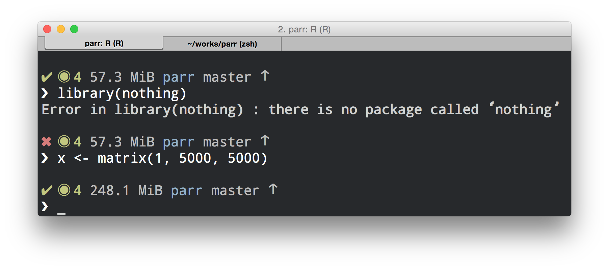

---
output:
  github_document:
    html_preview: false
---

<!-- README.md is generated from README.Rmd. Please edit that file -->

```{r, echo = FALSE}
knitr::opts_chunk$set(
  collapse = TRUE,
  comment = "#>",
  fig.path = "README-"
)
options(tibble.print_min = 5, tibble.print_max = 5)
```


# promptr

> Dynamic R Prompt

[](http://www.repostatus.org/#wip)

## Overview

This package is a fork from ["gaborcsardi/prompt"](https://github.com/gaborcsardi/prompt).
It is adjusted so that it works under WINDOWS. 
Prompts are modified to personal preferences.

## Installation

```{r, eval = FALSE}
# Install the development version from GitHub:
# install.packages("remotes")
remotes::install_github("cstepper/promptr")
```

## Original notes from Gabor Csardi



Set the R prompt dynamically, from a function. The package contains some
examples. The prompt on the screenshot has:
* The status of the last command (success or failure).
* The amount of memory allocated by the current R process.
* The name of the R package being developed using
  [devtools](https://github.com/hadley/devtools).
* Name of the active git branch.
* State of the git working tree (needs pushes, pulls, and/or dirty).

Use the `prompt_fancy` prompt, as on the screenshot, or create your own.

```r
library(prompt)
set_prompt(prompt_fancy)
```

## Usage


