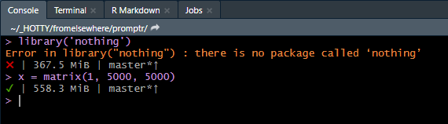

---
output:
  github_document:
    html_preview: false
---

<!-- README.md is generated from README.Rmd. Please edit that file -->

```{r, echo = FALSE}
knitr::opts_chunk$set(
  collapse = TRUE,
  comment = "#>",
  fig.path = "README-"
)
options(tibble.print_min = 5, tibble.print_max = 5)
```


# promptr

> Dynamic R Prompt

[](http://www.repostatus.org/#wip)

## Overview

This package is a fork from ["gaborcsardi/prompt"](https://github.com/gaborcsardi/prompt).
It is adjusted so that it works under WINDOWS. 
Prompts are modified to personal preferences.

## Installation

```{r, eval = FALSE}
# Install the development version from GitHub:
# install.packages("remotes")
remotes::install_github("cstepper/promptr")
```

## Original notes from Gabor Csardi


Set the R prompt dynamically, from a function. The package contains some
examples. The prompt on the screenshot has:

* The status of the last command (success or failure).
* The amount of memory allocated by the current R process.
* The name of the R package being developed using
  [devtools](https://github.com/hadley/devtools).
* Name of the active git branch.
* State of the git working tree (needs pushes, pulls, and/or dirty).

Use the `prompt_fancy` prompt, as on the screenshot, or create your own.

```r
library(prompt)
set_prompt(prompt_fancy)
```

## Usage

Use the `prompt_fancy`, if you'd like to get information about the 

* status of the last command (success or failure).
* amount of memory allocated by the current R process.
* name of the active git branch.
* state of the git working tree (needs pushes, pulls, and/or dirty).

```{r, eval=FALSE}
library('promptr')
set_prompt(prompt_fancy)
```




Alternatively, you can choose `prompt_memuse` for the memory allocation 
info only, or `prompt_git` for info on the current status of your git branch.

Change the prompt with: 

```{r}
library('promptr')
# set prompt
set_prompt(prompt_memuse)
# disable again
suspend()
# set another prompt
set_prompt(prompt_git)
# disable again
suspend()
```


## Notes

If you'd like to use any prompt permanenty, you can modify 
your `~/Documents/.Rprofile` with something like this:


```{bash, eval=FALSE}
.First <- function() {
   if (interactive() == TRUE) {
     library("promptr")
     set_prompt(prompt_memuse)
   }
}

```

