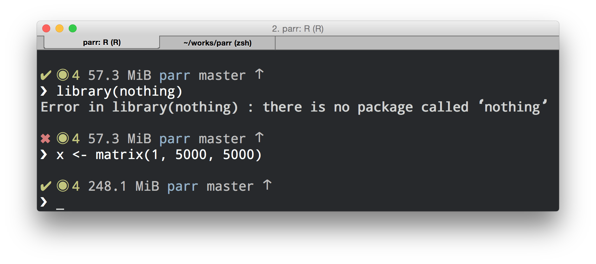

<!-- README.md is generated from README.Rmd. Please edit that file -->

# promptr

> Dynamic R Prompt

[](http://www.repostatus.org/#wip)

## Overview

This package is a fork from
[“gaborcsardi/prompt”](https://github.com/gaborcsardi/prompt). It is
adjusted so that it works under WINDOWS. Prompts are modified to
personal preferences.

## Installation

``` r
# Install the development version from GitHub:
# install.packages("remotes")
remotes::install_github("cstepper/promptr")
```

## Original notes from Gabor Csardi



Set the R prompt dynamically, from a function. The package contains some
examples. The prompt on the screenshot has:

  - The status of the last command (success or failure).
  - The amount of memory allocated by the current R process.
  - The name of the R package being developed using
    [devtools](https://github.com/hadley/devtools).
  - Name of the active git branch.
  - State of the git working tree (needs pushes, pulls, and/or dirty).

Use the `prompt_fancy` prompt, as on the screenshot, or create your own.

``` r
library(prompt)
set_prompt(prompt_fancy)
```

## Usage

Use the `prompt_fancy`, if you’d like to get information about the

  - status of the last command (success or failure).
  - amount of memory allocated by the current R process.
  - name of the active git branch.
  - state of the git working tree (needs pushes, pulls, and/or dirty).

<!-- end list -->

``` r
library('promptr')
set_prompt(prompt_fancy)
```


Alternatively, you can choose `prompt_memuse` for the memory allocation
info only, or `prompt_git` for info on the current status of your git
branch.

Change the prompt with:

``` r
library('promptr')
# set prompt
set_prompt(prompt_memuse)
#> 70.8 MiB
# disable again
suspend()
# set another prompt
set_prompt(prompt_git)
#> master*
# disable again
suspend()
```

## Notes

If you’d like to use any prompt permanenty, you can modify your
`~/Documents/.Rprofile` with something like this:

``` bash
.First <- function() {
   if (interactive() == TRUE) {
     library("promptr")
     set_prompt(prompt_memuse)
   }
}
```
